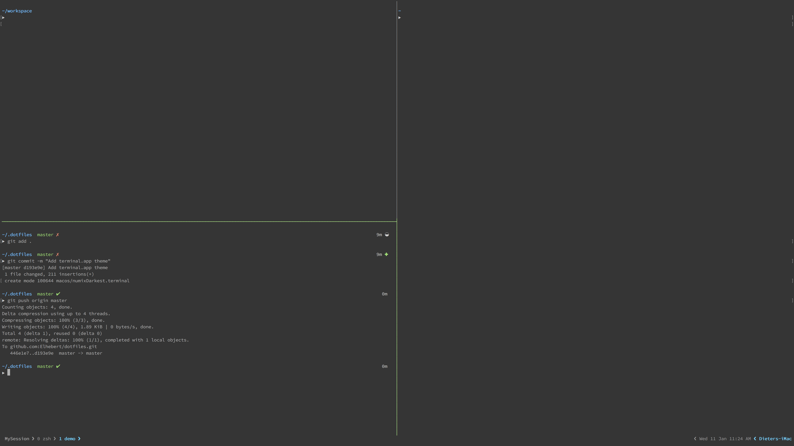

# dotFILES

These are my personal configuration files for tmux, vim and zsh.

Because I'm mostly work with macOS systems at the moment I'm going to put OS-specific configuration in folders, while OS-agnostic files will stay in the root folder. 

A macOS folder should arrive shortly.

### Dev environment

In this repository I'll version the configuration and customization for the following tools:

- zsh
- tmux
- vim
- VS Code

With of course a script that set-up a "dev-ready" machine with all the tools, libs and software I need.

### Preview

#### Mac

